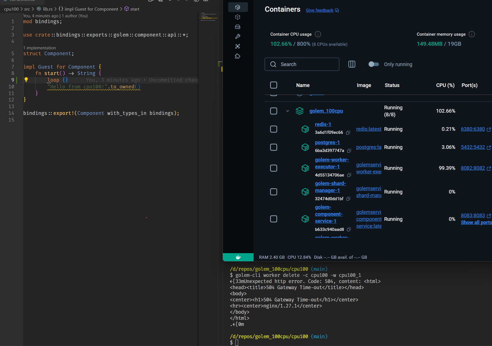

# golem_100cpu

### Build & Run

1. `docker-compose -f docker-compose-postgres.yaml up`
2. `cd cpu100`
3. `cargo component build --release`
4. `golem-cli component add -c cpu100 target/wasm32-wasi/release/cpu100.wasm`
5. `golem-cli worker add -c cpu100 -w cpu100_1`
6. `golem-cli worker invoke-and-await -c cpu100 -w cpu100_1 -f 'golem:component/api.{start}'`

### Delete Worker

- `golem-cli worker delete -c cpu100 -w cpu100_1`

### Rebuild & Redeploy

- `cargo component build --release && golem-cli component add -y -c cpu100 target/wasm32-wasi/release/cpu100.wasm && golem-cli component redeploy -y -c cpu100`
